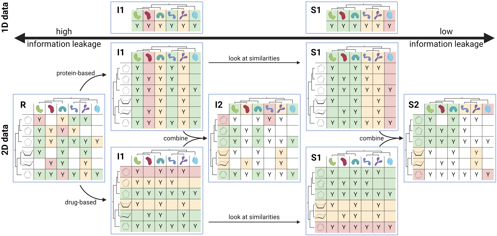

# DataSAIL: Data Splitting Against Information Leaking 


[](https://datasail.readthedocs.io/en/latest/index.html)
[](https://codecov.io/gh/kalininalab/DataSAIL)
[](https://anaconda.org/kalininalab/datasail)
[](https://anaconda.org/kalininalab/datasail)
[](https://anaconda.org/kalininalab/datasail)
[](https://anaconda.org/kalininalab/datasail)

[](https://doi.org/10.5281/zenodo.13938602)

DataSAIL, short for Data Splitting Against Information Leakage, is a versatile tool designed to partition data while 
minimizing similarities between the partitions. Inter-sample similarities can lead to information leakage, resulting 
in an overestimation of the model's performance in certain training regimes.

DataSAIL was initially developed for machine learning workflows involving biological datasets, but its utility extends to
any type of datasets. It can be used through a command line interface or integrated as a Python package, making it
accessible and user-friendly. The tool is licensed under the MIT license, ensuring it remains open source and freely
available here on GitHub.

A detailed documentation of the package, explanations, examples, and much more are given on DataSAIL's [ReadTheDocs page](https://datasail.readthedocs.io/en/latest/index.html). 

## Installation

DataSAIL is available for all modern versions of Python (v3.9 or newer). We ship two versions of DataSAIL:
- `DataSAIL`: The full version of DataSAIL, which includes all third-party clustering algorithms and is available on conda for linux and OSX (called `datasail`).
- `DataSAIL-lite`: A lightweight version of DataSAIL, which does not include any third-party clustering algorithms and is available on PyPI (called `datasail`) and conda (called `datasail-lite`).

**_NOTE:_** There is a naming-inconsitency between the conda and PyPI versions of DataSAIL. The lite version is called `datasail-lite` on conda, while it is called `datasail` on PyPI. This will be fixed in the future, but for now, please be aware of this inconsistency.

## Usage

DataSAIL is installed as a command-line tool. So, in the conda environment, DataSAIL has been installed to, you can run 

````shell
datasail --e-type P --e-data <path_to_fasta> --e-sim mmseqs --output <path_to_output_path> --technique C1e
````

to split a set of proteins that have been clustered using mmseqs. For a full list of arguments, run `datasail -h` and checkout [ReadTheDocs](https://datasail.readthedocs.io/). There is a more detailed explanation of the arguments and example notebooks. The runtime largy depends on the number and type of splits to be computed and the size of the dataset. For small datasets (less then 10k samples) DataSAIL finished within minutes. On large datasets (more than 100k samples) it can take several hours to complete.
Regardless of which installation command was used, DataSAIL can be executed by running

````shell
datasail -h
````

in the command line and see the parameters DataSAIL takes. DataSAIL can also directly be included as a normal package into your Python program using

````python
from datasail.sail import datasail
splits = datasail(...)
````

For more information about the parameters, please read through the [documentation page]()

## When to use DataSAIL and when not to use


DataSAIL offers a variety of ways to split one-dimensional and multi-dimensional data. Here exemplarily shown for a generic protein property prediction task and a protein-ligand interaction prediction dataset.

The datasplit employed should always reflect the inference reality the model is facing. So, if the model is intended to perform well on unseen data, the validation and test data shall be new between splits.

For more information, please see our [guideline to selecting datasplits]() in the documentation.

## Citation

If you used DataSAIL to split your data, please cite DataSAIL in your publication.
````
@article{joeres2025datasail,
  title={Data splitting to avoid information leakage with DataSAIL},
  author={Joeres, Roman and Blumenthal, David B. and Kalinina, Olga V.},
  journal={Nature Communications},
  volume={16},
  pages={3337},
  year={2025},
  doi={10.1038/s41467-025-58606-8},
}
````
