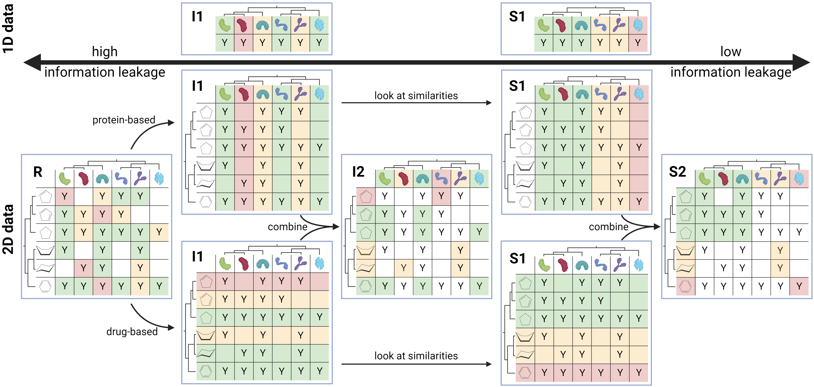

# DataSAIL: Data Splitting Against Information Leaking 


[](https://datasail.readthedocs.io/en/latest/index.html)
[](https://codecov.io/gh/kalininalab/DataSAIL)
[](https://anaconda.org/kalininalab/datasail)
[](https://anaconda.org/kalininalab/datasail)
[](https://anaconda.org/kalininalab/datasail)
[](https://anaconda.org/kalininalab/datasail)

[](https://doi.org/10.5281/zenodo.13938602)

DataSAIL, short for Data Splitting Against Information Leakage, is a versatile tool designed to partition data while 
minimizing similarities between the partitions. Inter-sample similarities can lead to information leakage, resulting 
in an overestimation of the model's performance in certain training regimes.

DataSAIL was initially developed for machine learning workflows involving biological datasets, but its utility extends to
any type of datasets. It can be used through a command line interface or integrated as a Python package, making it
accessible and user-friendly. The tool is licensed under the MIT license, ensuring it remains open source and freely
available here on [GitHub](https://github.com/kalininalab/datasail).

A detailed documentation of the package, explanations, examples, and much more are given on DataSAIL's [ReadTheDocs page](https://datasail.readthedocs.io/en/latest/index.html). 

## Installation

**_NOTE:_** This installation instruction changed in version 1.4.0 compared to previous versions. The usage remains the same, both as a python package and as a commandline tool.

DataSAIL is available for all modern versions of Python (v3.10 or newer). You can install DataSAIL using either pip (recommended).

```shell
pip install datasail
```
or conda/mamba

```shell
mamba install -c conda-forge -c kalininalab datasail
```

Until version 1.3.0, DataSAIL was available in two versions. From version 1.4.0 onwards, we have merged the two versions into a single one. Both verions come without third-party clustering algorithms such as MMseqs2, CD-HIT, FoldSeek or MASH. If you want to use these tools, please install them separately and make sure they are in your PATH. For more information on how to install these tools, please see the [documentation page](https://datasail.readthedocs.io/en/latest/installation.html#external-clustering-tools).

**_NOTE:_** If you install DataSAIL from conda, it is recommended to use `mamba <https://mamba.readthedocs.io/en/latest/installation/mamba-installation.html>`_
    because conda might not be able to resolve the dependencies of DataSAIL successfully.

By default, DataSAIL v1.4 installs NumPy v2. If you want to use DataSAIL with NumPy v1, please use 

```shell
pip install datasail numpy<2
```

for installing from the PyPI or

```shell
mamba install -c conda-forge -c kalininalab datasail numpy<2
```

to install from conda/mamba.

## Quick start

DataSAIL comes with a command-line interface and as a Python package. The main functionality can be accessed by, e.g., running the following command in the terminal: 

```shell
datasail --output <path_to_output_path> --technique C1e --e-type P --e-data <path_to_fasta> --e-sim mmseqs
```

or in a Python program by

```python
from datasail.sail import datasail

splits = datasail(technique=["C1e"], e_type="P", e_data="<path_to_fasta>", e_sim="mmseqs", output="<path_to_output_path>")
```

Here, the output argument is optional and saves the results in a folder in addition to returning them. For more information about the parameters, please read through the [documentation page](https://datasail.readthedocs.io/en/latest/interfaces/cli.html).

## When to use DataSAIL and when not to use


DataSAIL offers a variety of ways to split one-dimensional and multi-dimensional data. Here exemplarily shown for a generic protein property prediction task and a protein-ligand interaction prediction dataset.

The datasplit employed should always reflect the inference reality the model is facing. So, if the model is intended to perform well on unseen data, the validation and test data shall be new between splits.

For more information, please see our [guideline to selecting datasplits](https://datasail.readthedocs.io/en/latest/workflow/splits.html) in the documentation.

## FAQ

For frequently asked questions, please refer to the [FAQ section](https://datasail.readthedocs.io/en/latest/faq.html).

## Citation

If you used DataSAIL to split your data, please cite DataSAIL in your publication.
````
@article{joeres2025datasail,
  title={Data splitting to avoid information leakage with DataSAIL},
  author={Joeres, Roman and Blumenthal, David B. and Kalinina, Olga V.},
  journal={Nature Communications},
  volume={16},
  pages={3337},
  year={2025},
  doi={10.1038/s41467-025-58606-8},
}
````
