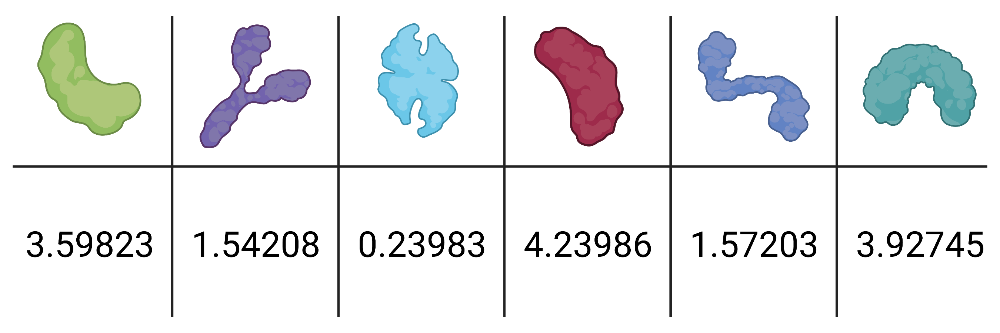
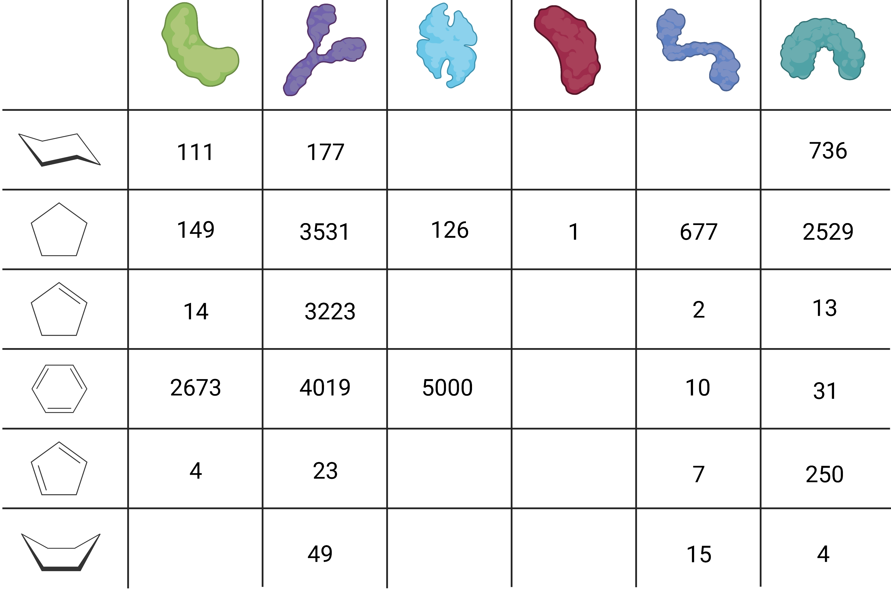

******
Splits
******

In this section, we will discuss the different splitting techniques DataSAIL provides for splitting datasets.

First, we need state what we consider to be one-dimensional data and two-dimensional data. The motivation for these
names become clear in the depictions below.

One-Dimensional Data
--------------------

We consider one-dimension data to be data where the task is to predict one or more features of one input system.
Examples are protein classification or molecular property prediction. The input system refers to proteins or molecules
in the examples. We call them "input system", as in the era of GNNs "input variables" are probably not appropriate
anymore.

Two-Dimensional Data
--------------------

This is data with two input systems. Examples are interaction datasets such as protein-protein or drug-target
interaction prediction datasets. Here, the two input systems are two sets of proteins or drugs and their targets. The
two-dimensionality becomes clear from the example.

