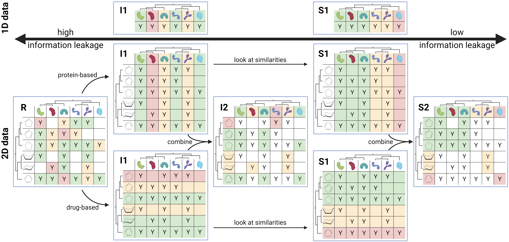

.. _splits-label:

######
Splits
######

In this section, we will discuss the different splitting techniques DataSAIL provides for splitting datasets.

First, we need state what we consider to be one-dimensional data and two-dimensional data. The motivation for these
names become clear in the depictions below.

All splitting teechniques and how they relate to each other are visualized in the following image:

One-Dimensional Data
####################

We consider one-dimension data to be data where the task is to predict one or more features of one input system.
Examples are protein classification or molecular property prediction. The input system refers to proteins or molecules
in the examples. We call them "input system", as in the era of GNNs "input variables" are probably not appropriate
anymore.

Two-Dimensional Data
####################

This is data with two input systems. Examples are interaction datasets such as protein-protein or drug-target
interaction prediction datasets. Here, the two input systems are two sets of proteins or drugs and their targets. The
two-dimensionality becomes clear from the example.

Two dimensional data can be threaten as one-dimensional data when ignoring one dimension of the data. Therefore, ever
technique to split one-dimensional data can be applied to two dimensional data as well (and in both dimensions).

Splitting Techniques
####################
We will discuss the different techniques to split a dataset based on this exemplary interaction table. The proteins are
made up and chosen by their shape. Interaction with any of the ligands are random and unintentionally. Ad an example to
visualize all these techniques, we will use the interaction-dataset visualized above. Furthermore, we will always split
into 3 splits (green, yellow, and red). All non-colored fields are interactions that are lost from the full dataset.

Random Split (R)
================

This is the most simple split and the most widely used one. Here, datapoints are randomly assigned to splits.
Therefore, the amount of leaked data is the biggest here.

Identity-based One-dimensional split (I1)
=========================================

The easiest step in reducing information leaks is to make sure that all samples associated with one ID is one dimension
end up in the same split. Therefore, a model cannot memorize this ID between training, validation, and test. In this
case DataSAIL only optimizes the sizes of the splits towards the request by the user.

Identity-based Two-dimensional split (I2)
=========================================

This can be enforced to both dimensions in case of a two-dimensional dataset. But, because all samples belong to one ID
from wither either dimension, there are samples having their IDs in different splits. These samples cannot be assigned
to any set and therefore are lost. In this scenario, DataSAIL reduces the number of lost samples while keeping the
sizes of the splits close to what the user requested.

Similarity-based One-dimensional split (S1)
===========================================

The next step is to cluster IDs before splitting. This is useful as samples of one dimension might be similar to each
other. By making sure all datapoints of similar IDs remain in the same split, the model cannot memorize similarities of
IDs and extrapolate them between splits. Here, DataSAIL optimizes for the overall information leak as well as for the
size of the splits to be similar to what has been requested.

Similarity-based Two-Dimensional split (S2)
===========================================

Lastly, this cluster-based splitting can be enforced on both dimensions of a two-dimensional dataset to reduce
information leaks further more. Here, DataSAIL extends the objective from above with a penalty for lost samples.

