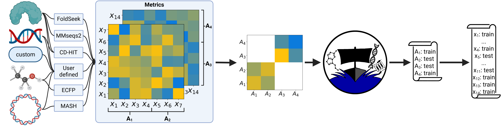

DataSAILs General Workflow
==========================

DataSAIL is mostly a concatenation of existing tools, and the workflow is designed to be modular. The main steps are:

1. **Preparation**: This step involves reading data from files. Which filetypes are allowed and what they have to contain depends on the input 
and can be checked on the :ref:`input-types page <input-label>`

2. **Clustering**: The data is clustered using the :ref:`clustering module <clustering-label>`. This step is optional, 
but it is recommended to compute data splits with minimized similarity-induced information leakage.

3. **Splitting**: The data is split into as many splits as desired. Here is where the DataSAIL magic happens. 
Internally, DataSAIL uses an ILP (Integer Linear Program) based on a constrained optimization problem and use convex solvers to find the best split. More information about the solvers is given :ref:`here <solver-label>`.

4. **Storing**: Lastly, the splits are converted back to mappings of input-datapoints to splits and either stored in a file or returned as a dictionary.

An overview and a detailed description of the datasplits DataSAIL can compute is given on the :ref:`splits page <splits-label>`.